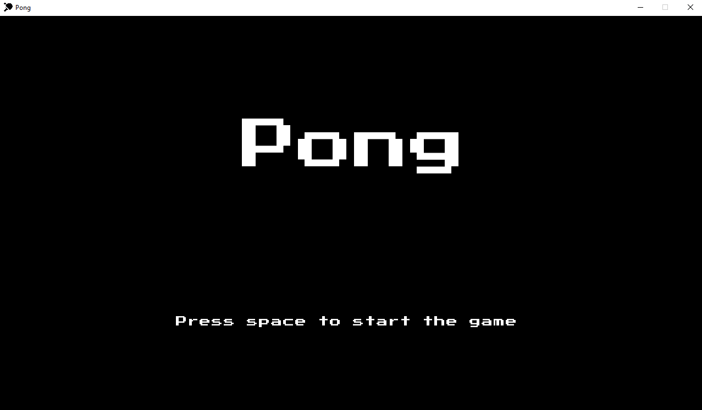
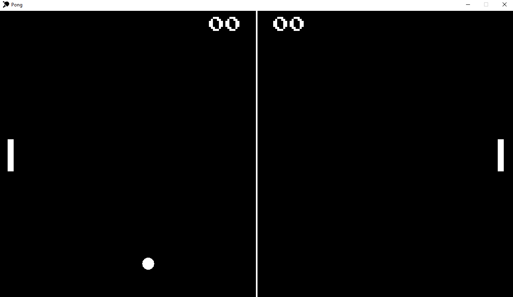

# <p align=center>Ping Pong 🏓</p>

<p align=center> A simple ping pong game made using libGDX library, inspired by the classic 70s Atari Pong. </p>

## Features

- **Two-player mode:** Play with a friend on the same computer.
- **Score tracking:** Keep track of the scores during the game.
- **Sound effects:** Realistic sound effects for a formidable experience.

### Screenshots




## Controls

- **Player 1:**
    - Move Up: `W`
    - Move Down: `S`
- **Player 2:**
    - Move Up: `↑`
    - Move Down: `↓`

## Installation

To play the game, you need to have Java installed on your system. You can download the game as an executable file or clone the repository and run it from the source code.

### Downloading the Executable

1. Go to description link or just click here [Game](https://gamejolt.com/games/ping-pong/923518).
2. Download the latest version of the game.
3. Run the downloaded `.exe`.

### Running from Source

1. Clone the repository:
   ```bash
   git clone https://github.com/rleo05/ping-pong-java.git
   ```
2. Navigate to the project directory:
   ```bash
   cd ping-pong-java
   ```
3. Run the game using Gradle or any Java IDE like IntelliJ IDEA or Eclipse:
   ```bash
   ./gradlew desktop:run
   ```

## How to Play

1. Launch the game.
2. Control your paddle using the keyboard keys (`W` and `S` for Player 1, `↑` and `↓` for Player 2).
3. Hit the ball with your paddle and try to make your opponent miss.
4. The first player to score 5 points wins the game.

## License

This project is licensed under the MIT License - see the [LICENSE](https://github.com/rleo05/ping-pong-java/blob/main/LICENSE) file for details.
